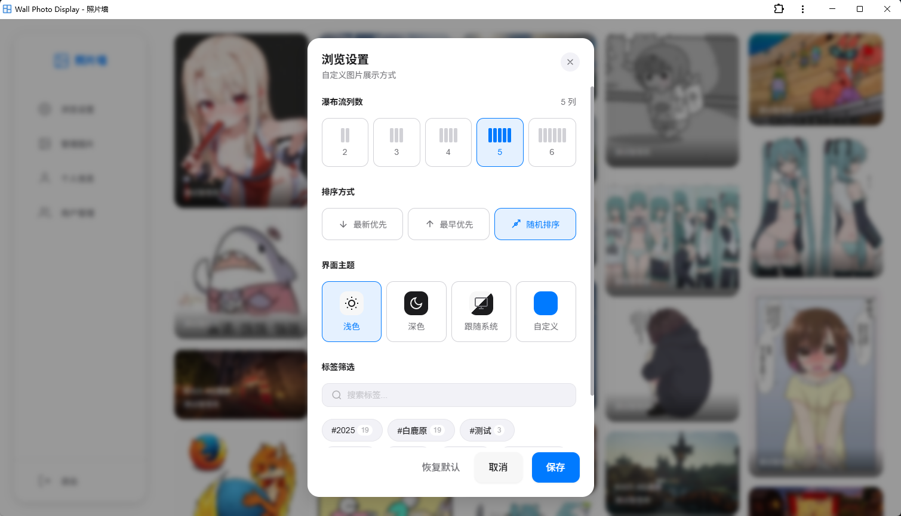
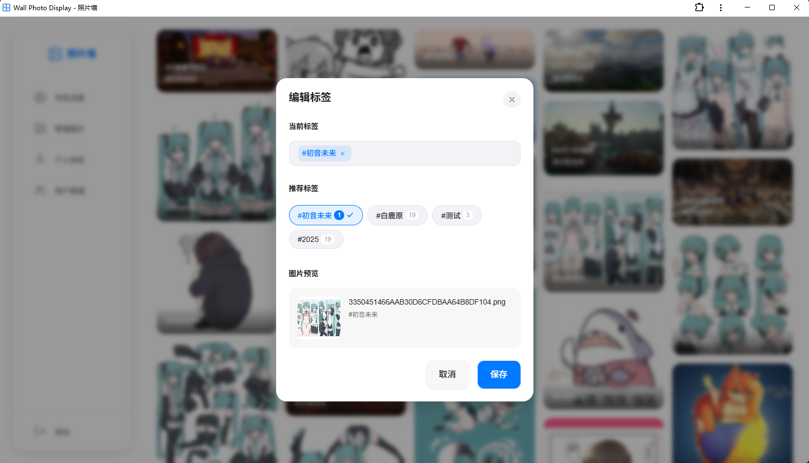

# Wall Photo Display 🖼️

多用户照片墙系统 - 基于 Vue 3 + Express.js 的渐进式网页应用（PWA）


## ✨ 功能特性

- 📸 **瀑布流照片展示** - 响应式瀑布流布局，支持自定义列数
- 🏷️ **标签管理** - 灵活的标签系统，支持按标签筛选照片
- 👥 **多用户支持** - 用户注册、登录，管理员权限控制
- 🎨 **主题定制** - 支持明/暗主题切换，可跟随系统
- 📱 **PWA 支持** - 可安装为桌面/移动应用，支持离线访问
- 🖱️ **丰富的交互** - 右键菜单、批量操作、图片放大预览
- 📤 **便捷上传** - 支持拖拽上传，自动生成缩略图

## 📷 截图预览






## 🛠️ 技术栈

| 层级 | 技术选型 |
|------|----------|
| 前端框架 | Vue 3 + Vite + TypeScript |
| 状态管理 | Pinia |
| HTTP 客户端 | Axios |
| 后端框架 | Express.js + TypeScript |
| 数据库 | SQLite (better-sqlite3) |
| 认证 | JWT (jsonwebtoken) |
| 文件上传 | Multer |
| 图片处理 | Sharp |
| PWA | vite-plugin-pwa |

## 📦 项目结构

```
wall-photo-display/
├── server/              # Express.js 后端
│   ├── routes/          # API 路由
│   ├── controllers/     # 业务逻辑
│   ├── models/          # 数据模型
│   ├── middleware/      # 中间件 (认证、上传)
│   └── config/          # 配置文件
├── src/                 # Vue 3 前端
│   ├── api/             # API 接口封装
│   ├── stores/          # Pinia 状态管理
│   ├── components/      # Vue 组件
│   │   ├── layout/      # 布局组件
│   │   ├── photo/       # 照片相关组件
│   │   ├── dialogs/     # 弹窗组件
│   │   └── common/      # 通用组件
│   ├── composables/     # 组合式函数
│   ├── styles/          # 样式文件
│   └── utils/           # 工具函数
├── uploads/photos/      # 用户上传的图片
└── data/                # SQLite 数据库文件
```

## 🚀 快速开始

### 环境要求

- **Node.js** 18.x 或更高版本（推荐 20.x LTS）
- **npm** 9.x 或更高版本

### 安装步骤

1. **克隆仓库**

```bash
git clone https://github.com/LunaDeerTech/WallPhotoDisplay.git
cd WallPhotoDisplay
```

2. **安装依赖**

```bash
npm install
```

3. **配置环境变量**

创建 `.env` 文件：

```env
NODE_ENV=production

# 服务器配置
PORT=3000

# JWT 密钥（请修改为随机字符串）
JWT_SECRET=your-super-secret-jwt-key

# 数据库路径
DB_PATH=./data/photowall.db

# 上传文件路径
UPLOAD_PATH=./data/uploads
```

4. **初始化数据库**

```bash
npm run init-db
```

这将创建数据库表并生成默认管理员账户：
- 用户名：`admin`
- 密码：`admin123`

> ⚠️ 请在首次登录后立即修改默认密码！

5. **构建前后端**

```bash
npm run build:all
```

6. **启动生产服务器**

```bash
npm run start
```

服务将在 http://localhost:3000 启动。

## 📄 开发计划

### Milestone 1: MVP
- [x] 多用户创建与登录
- [x] 瀑布流照片展示
- [x] 照片标签管理与筛选
- [x] 照片上传与缩略图生成
- [x] PWA 支持与离线访问

### Milestone 2: Enhancements
- [ ] 自动生成用户标签
- [ ] 用户上传图片自动关联用户标签
- [ ] 系统设置菜单
- [ ] 用户注册功能
- [ ] 系统设置-是否开放注册
- [ ] 上传审核
- [ ] 系统设置-上传是否需要审核
- [ ] 系统设置-是否强制需要登录才能查看
- [ ] 长时间无关联图片的 Tag 自动清理

### Milestone 3: Enrichments
- [ ] 多语言 i18n 支持
- [ ] 图片点赞
- [ ] 图片可见性设置（公开/私密）
- [ ] 图片管理以时间线形式展示
- [ ] 图片管理按时间筛选
- [ ] 用户头像上传与显示
- [ ] API调用/用户token生成

### Milestone 4: Advanced Features
- [ ] 图片评论功能
- [ ] 举报/封禁/审核功能
- [ ] 排行榜